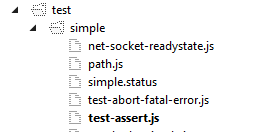

##Node.js UWP
This project is a Universal Windows Platform (UWP) application that wraps Node.js and enables deployment to Windows IoT Core devices from Visual Studio.
The application is packaged into the [NTVS IoT Extension (Beta)](https://github.com/ms-iot/ntvsiot) installer. The NTVS IoT Extension gives you the ability
to create Node.js applications and easily deploy and debug them on Windows IoT Core devices. During deployment, the extension will create a UWP package that
contains:

* nodeuwp.dll: That's this UWP application.
* node.dll (GitHub link coming soon): This is based on [Node.js with Chakra](https://github.com/Microsoft/node) with a few differences: 
  * Code that not allowed in a UWP app container is disabled.
  * Code links to onecore.lib (instead of legacy DLL's like kernel32.dll, etc.) to enable it to run on Windows IoT Core.
* uwp.node (code [here](https://github.com/Microsoft/node-uwp)): This is the addon that allows you to access UWP namespaces from Node.js code.
* Your Node.js code and other files you choose to package.

To get started, take a look at the "Hello World" sample [here](http://ms-iot.github.io/content/en-US/win10/samples/NodejsWU.htm).

##To build

Prerequisites:

    * Windows 10 (latest)
    * Python 2.6 or 2.7
    * Visual Studio 2015 (RC or later)
    * Windows 10 Tools (Bundled in Visual Studio 2015, or install separately)
	* Clone Node.js from https://github.com/microsoft/node

Steps:

* Open cmd window
* Set node_dir to the path of your Node.js clone
* Set release_dir if desired (optional if copyrelease is not used)
* Run "build.bat [x86|x64|arm] [copyrelease] [builduwpaddon]". 
  * If no platform is provided, all platforms (x86, x64, and ARM) will be built.
  * copyrelease can be used to choose the release directory where nodeuwp.dll, node.dll, and uwp.node will be copied.
  * builduwpaddon can be used to build the uwp addon.
  
##Running Node.js tests
Follow the steps below to run [tests](https://github.com/joyent/node/tree/master/test) included with Node.js.

* Clone Node.js from [https://github.com/microsoft/node](https://github.com/microsoft/node)
* Install the NTVS IoT Extension using the steps [here](http://ms-iot.github.io/content/en-US/win10/samples/NodejsWU.htm) and create a new Node.js (Windows Universal) project
* Copy &lt;Node.js clone path&gt;\tests to &lt;Node.js UWP project path (location of .njsproj file)&gt;\tests
* Right click on the test you want to run and select "Set as Node.js Startup File". The file text will be made bold (see test-assert.js example below)

  

* Press F5 (or click on Debug->Start Debugging menu) to run the test
* Console output can be redirected to file. You can view the logs on the device in C:\Users\DefaultAccount\AppData\Local\Packages\ &lt;Your app ID (get it from VS build logs)&gt;\LocalState\nodeuwp.log
	
##Node.js API compatibility with UWP

API | Supported
--- | ---
Assert | Yes
Buffer | Yes
Child Processes | **No**
Cluster | **No**
Console | Output can optionally be redirected to file
Crypto | In testing
Debugger | **No**
DNS | Yes
Domain | Yes
Events | Yes
File System | In testing
Globals | In testing
HTTP | Yes
HTTPS | In testing
Modules | Yes
Net | Yes
OS | In testing
Path | Yes
Process | In testing
Punycode | Yes
Query Strings | In testing
Readline | Yes
REPL | Yes
Smalloc | Yes
Stream | In testing
String Decoder | In testing
Timers | Yes
TLS/SSL | In testing
TTY | **No**
UDP/Datagram | Yes
URL | Yes
Utilities | In testing
VM | Yes
ZLIB | Yes

**Note:** 
There may be some limitations in supported modules. For example, the [fs](https://nodejs.org/api/fs.html) module can only access files within its the UWP package or within paths declared in its [package capabilities](https://msdn.microsoft.com/en-us/library/windows/apps/hh464936.aspx).
'In testing' in the Supported column means the API may work for the most part but some failures may be seen (see compatibility.xlsx below). 

A detailed list with methods in the API and their pass/fail status can be seen [here](./compatibility.xlsx).
